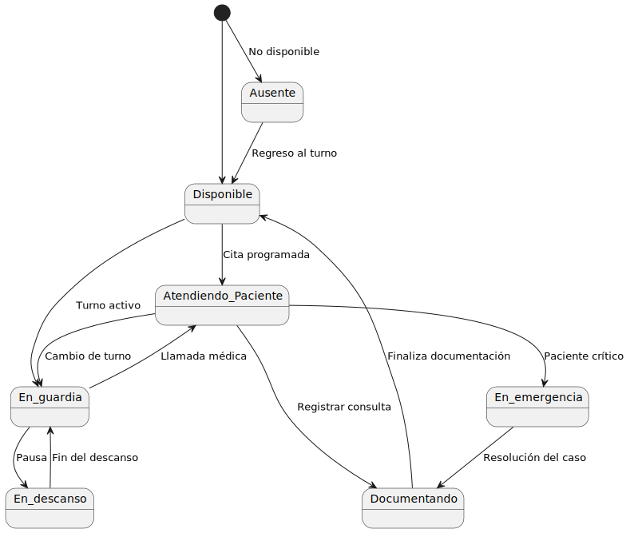

# ACTIVIDAD POST PARCIAL

## ITERACION DEL EXAMEN

## MODELO DEL DOMINIO

### [DIAGRAMA DE ENTIDADES](modelosUML/Iteracion_en_examen/Diagrama_entidades.puml)

### [DIAGRAMA DE CLASES](modelosUML/Iteracion_en_examen/Diagrama_clases.puml)

### DIAGRAMAS DE ESTADOS
#### [PACIENTE](modelosUML/Iteracion_en_examen/Diagrama_estados_paciente.puml)

#### [PROFESIONAL MÉDICO](modelosUML/Iteracion_en_examen/Diagrama_estados_Prof_medico.puml)

#### [Tratamiento](modelosUML/Iteracion_en_examen/Diagrama_estados_tratamiento.puml)

## NUEVA ITERACIÓN
### [DIAGRAMA DE ENTIDADES](modelosUML/Nueva_iteracion/Diagrama_entidades.puml)

### [DIAGRAMA DE CLASES](modelosUML/Nueva_iteracion/Diagrama_clasesv2.puml)

### DIAGRAMAS DE ESTADOS
#### [PACIENTE](modelosUML/Nueva_iteracion/Diagrama_estado_paciente.puml)

#### [PROFESIONAL MÉDICO](modelosUML/Nueva_iteracion/Diagrama_estado_prof_medico.puml)

#### [Tratamiento](modelosUML/Nueva_iteracion/Diagrama_estado_tratamiento.puml)

#### [Cita](modelosUML/Nueva_iteracion/Diagrama_estado_cita.puml)

